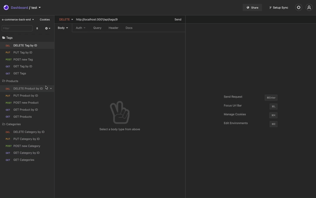
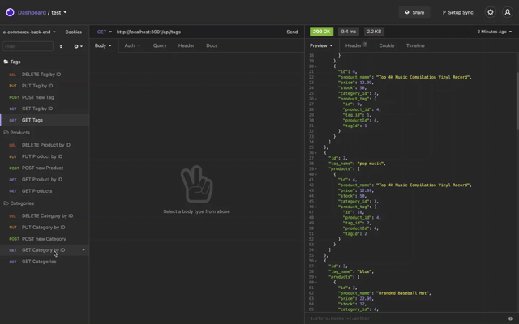
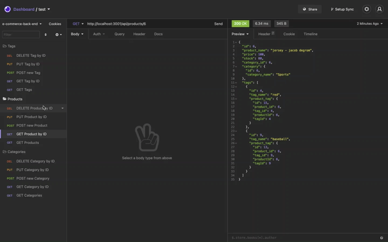

# Ecommerce Back End/ 13-e-commerce-back-end

[](https://opensource.org/licenses/MIT)

- [Repo](https://github.com/yondav/13-e-commerce-back-end)

## About / Synopsis

Ecommerce Back End is a simple database application made to keep track of a product list. The database was built with [sequelize](https://sequelize.org/) and [mysql](https://www.mysql.com/).

[Express](http://expressjs.com/) server supports `GET`, `POST`, `PUT` and `DELETE` requests.

---

## Table of contents

> - [Title / Repository Name](#title--repository-name)
>   - [About / Synopsis](#about--synopsis)
>   - [Table of contents](#table-of-contents)
>   - [Installation](#installation)
>   - [Usage](#usage)
>     - [Config](#config)
>     - [Schema](#schema)
>     - [Seed](#seed)
>     - [Start Server](#start-server)
>   - [Author](#author)
>     - [Contact](#contact)
>   - [Contributing / Issues](#contributing--issues)
>     - [Contributing](#contributing)
>     - [Reporting Issues](#reporting-issues)
>   - [License](#license)

---

## Installation

- Clone repo
- Open integrated terminal on the root directory
- Install dependencies :
  [express](https://www.npmjs.com/package/express), [sequelize](https://www.npmjs.com/package/sequelize), [mysql2](https://www.npmjs.com/package/mysql2), [dotenv](https://www.npmjs.com/package/dotenv)

```
npm i
```

---

## Usage

---

### Config

Configure `.env.EXAMPLE`

- rename file to `.env`

```
DB_NAME=ecommerce_db
DB_USER=
DB_PW=
```

```
DB_NAME=ecommerce_db
DB_USER=root
DB_PW=Password
```

---

### Schema

`db` directory holds `schema.sql` with script to create database in Workbench or from the command line.

```
npm run seed
```

---

### Seed

`seeds` directory holds placeholder data to seed the database. Data can be changed to suit users needs or preference.

```
npm run seed
```

---

### Start Server

```
npm start
```

for `nodemon server.js`:

```
npm run watch
```

---

### Live Demo

[Video Demonstration](https://youtu.be/MNXzsxjQ-5E)

## **GET**



## **GET BY ID**



## **POST**


## **PUT**


## **DELETE**



---

## Author

- <a href="https://yondav.us/">Yoni David</a>
- <a href="https://github.com/yondav">Github</a>

---

### Contact

Send emails to [yoni@yondav.us](mailto:yoni@yondav.us)

## Contributing / Issues

---

### Contributing

- Fork repo
- Make additions and changes on new, personalized branch
- Submit [pull request](https://github.com/yondav/13-e-commerce-back-end/pulls)

---

### Reporting Issues

Report issues by selecting the [issues](https://github.com/yondav/13-e-commerce-back-end/issues) tab and creating a new issue

---

## Licenses

- [MIT](https://github.com/yondav/13-e-commerce-back-end/blob/main/LICENSE)

This README file was built with [README Generator](https://github.com/yondav/README-gen-09)

Copyright &copy; 2021, Yoni David
